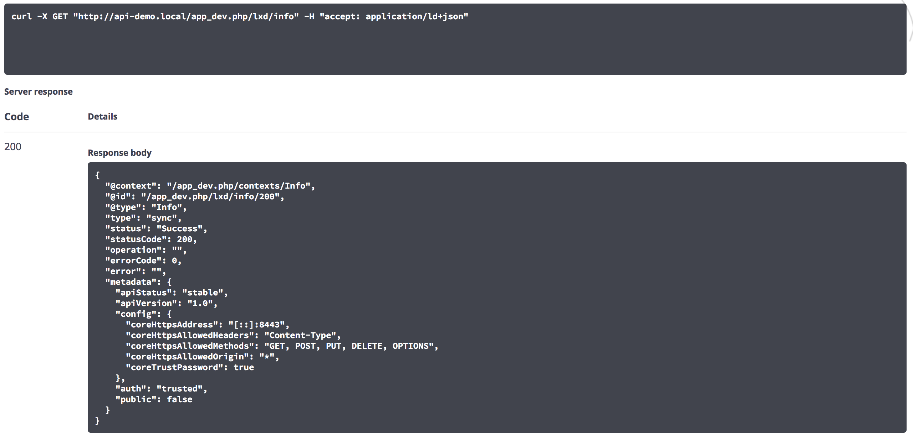
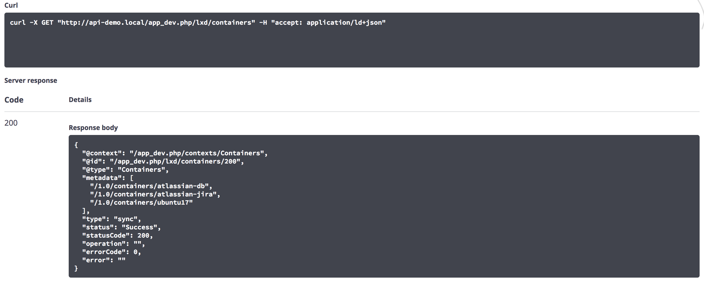

LxdBundle
=========

Managing LXD server through API-Platform

This is just skeleton (basically "scouting" the subject) for further development

Example of LXD server response @ https://server:port/1.0

Example of LXD container list

